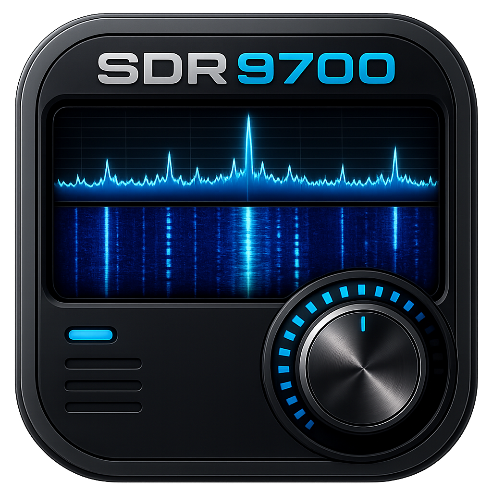

# SDR9700

<p align="center">
  
</p>

SDR9700 is a native Qt GUI for controlling the Icom IC-9700 amateur radio
transceiver over the radio's LAN interface. Supported operating systems
include Linux and macOS (Apple Silicon).

The project provides radio connection profiles, independent MAIN and SUB VFO
control, spectrum and waterfall display, gain/PTT controls, radio-backed memory
management, optional RC-28 integration, and RX/TX audio routing through Qt
Multimedia.


## Screenshots


## Status

SDR9700 is beta software. It provides a usable, IC-9700-focused LAN control
surface on Linux and Apple Silicon macOS, backed by automated protocol,
scheduler, routing, model, and GUI tests. Broader hardware coverage—especially
across different LAN conditions, Linux audio systems, and optional USB
controllers—is still needed before a stable release.

## Implemented Functionality

- Saved IC-9700 LAN radio profiles with username/password storage encrypted at
  rest.
- Radio chooser and preferences dialogs, including auto-connect and audio
  device selection.
- IC-9700 LAN connection over the radio UDP ports, with connection status,
  network quality reporting, and user-facing connection error messages.
- Independent MAIN and SUB VFO displays with receiver-specific frequency, mode,
  S-meter, squelch, AGC, attenuator, noise blanker, notch, noise reduction,
  preamp, and RF-gain state.
- MAIN/SUB selection, transactional MAIN ↔ SUB exchange, and dual-watch control
  with startup gating, transition lockout, recovery, and repeated-exchange
  stress coverage.
- Radio-backed controls for RF power, mic gain, duplex/offset, tone mode, CTCSS
  tone, and DCS/DTCS code in addition to the receiver-specific controls above.
- Local AF gain and mute controls.
- PTT control and LAN transmit audio support, including LAN MOD level control
  and transmit audio ramping.
- Spectrum and waterfall display from IC-9700 scope data, with frequency-step
  and span selectors, click-to-tune, recentering, and configurable peak hold of
  0, 1, 2, or 5 seconds.
- Receiver-aware scope and meter routing so MAIN/SUB activity follows the
  selected radio context without conflating the two receiver states.
- Network and status indicators for radio connectivity, LAN quality, CPU use,
  memory use, and transmit state.
- DTMF send panel with PTT gating.
- Receive-only AX.25 packet decoding from 1200-baud Bell 202 radio audio, with
  live decode-health indicators and text export in the Data Decoder window.
- Radio-backed IC-9700 memory management with add/edit/copy/remove, periodic and
  on-demand synchronization, CSV import/export, band filtering, ordering, and
  activation from the main-window memory browser. The active channel remains
  highlighted until its frequency, mode, duplex, offset, or tone settings
  change. Memory Manager selection is reserved for managing memory records and
  does not tune the radio; Add and Edit open a modal form over Memory Manager.
- Main-window lock mode that prevents accidental radio-control changes while
  leaving PTT, mute, and AF gain usable.
- Icom RC-28 rotary controller support for step tuning and button mapping,
  including active-low button handling, disconnect-safe PTT release, and LED
  feedback (requires `libhidapi` when building from source).

### Reliability and Diagnostics

- Duplicate CI-V LAN datagrams are suppressed before parser delivery, while
  packet loss and out-of-order arrival remain observable through transport
  diagnostics.
- Receiver-less CI-V frequency and mode replies are serialized by reply family
  so delayed responses cannot silently cross between overlapping MAIN/SUB
  requests under ordinary operation.
- High-rate tuning, polling, cache refresh, and UI routing paths use bounded
  queues, deduplication, coalescing, and backpressure to keep latency and memory
  use stable during sustained input.
- Startup radio reads are paced, and controls that can create conflicting radio
  work remain unavailable until the required VFO state is ready.
- Radio-session teardown follows the verified IC-9700 token-removal sequence,
  keeps required control traffic alive through shutdown, and preserves an
  unconditional PTT release path.
- Runtime logging can be enabled selectively with `--log=radio,udp,ci-v`, or in
  full with `--log=all`; `--log-file=<path>` writes the same diagnostics to a
  file.

## Installation

### macOS (Apple Silicon)

Download the `SDR9700-<version>-macOS-apple-silicon.dmg` release, open it, and
drag SDR9700 into Applications.

The release application includes Qt and its other runtime libraries. Users do
not need Homebrew, a separate Qt installation, or any other developer package
to run SDR9700. macOS will request local-network and microphone access because
the application communicates with the radio and can send transmit audio.

### Linux

Prebuilt Linux packages are not currently published. Follow the source-build
instructions below.

## Building from Source

Building requires a C++ toolchain, CMake, Ninja, GNU Make, pkg-config, Qt 6,
OpenSSL, Opus, SpeexDSP, Eigen, and optionally HIDAPI for RC-28 support.

On Debian, Ubuntu, and related Linux distributions:

```bash
sudo apt install build-essential cmake ninja-build pkg-config \
  qt6-base-dev qt6-multimedia-dev libssl-dev libopus-dev libspeexdsp-dev \
  libxkbcommon-dev libeigen3-dev libhidapi-dev
```

After building, `make install` creates the desktop launcher and icons for the
current user. It also requests administrator access to install the Icom RC-28
udev rule in `/etc/udev/rules.d`, reloads the rules, and triggers the `hidraw`
subsystem:

```bash
make release
make install
```

Reconnect the RC-28 after installation if it was already attached.

On macOS (Apple Silicon), Homebrew may be used to install build dependencies:

```bash
brew install cmake ninja pkg-config qt openssl@3 opus speexdsp eigen hidapi
```

Homebrew is needed only by developers building from source. It is not an
end-user runtime requirement.

```bash
make release
make run
```

`make release` performs a clean Release build in `src/build`. Only Release and
Debug CMake configurations are supported:

```bash
make debug
```

Run the complete automated test suite after either build:

```bash
ctest --test-dir src/build --output-on-failure
```

The built application can also be launched with diagnostics enabled. On Linux:

```bash
./src/build/bin/SDR9700 --log=radio,udp,ci-v
```

On macOS:

```bash
./src/build/bin/SDR9700.app/Contents/MacOS/SDR9700 --log=radio,udp,ci-v
```

## Repository Layout

- `src/gui/`: Qt widgets and dialogs.
- `src/models/`: UI-facing radio state models.
- `src/backend/`: bridge between models and the IC-9700 protocol stack.
- `src/radio/`: IC-9700 LAN and CI-V radio protocol code.
- `src/audio/`: Qt Multimedia audio handlers and conversion utilities.
- `src/core/`: settings, profile storage, queues, and shared types.
- `docs/`: architecture, development, protocol, and implementation research
  documentation.
- `resources/`: shared images, Qt resources, and platform-specific packaging
  assets under `resources/packaging/`.

## Documentation

The [documentation index](docs/README.md) links the architecture, development,
release, radio-protocol, and research material maintained with the source.

Repository-level policy and community documents remain at the project root:

- `AGENTS.md`: canonical AI-agent project guide.
- `CONVENTIONS.md`: coding standards and engineering rules.
- `CONTRIBUTING.md`: contributor workflow.
- `SECURITY.md`: vulnerability reporting.
- `CODE_OF_CONDUCT.md`: community behavior expectations.

## Acknowledgements

SDR9700 benefited from the public work, operator experience, and hard-won
lessons of the AetherSDR, wfview, and radio-webop projects. Their codebases and
communities helped validate radio behavior, highlight practical implementation
details, and provide useful points of comparison while SDR9700 was shaped into
its own IC-9700-focused application.

## License

SDR9700 is licensed under the GNU General Public License version 3. See
`LICENSE` for the full license text.

Third-party attribution is tracked in `THIRD_PARTY_LICENSES.md`.
