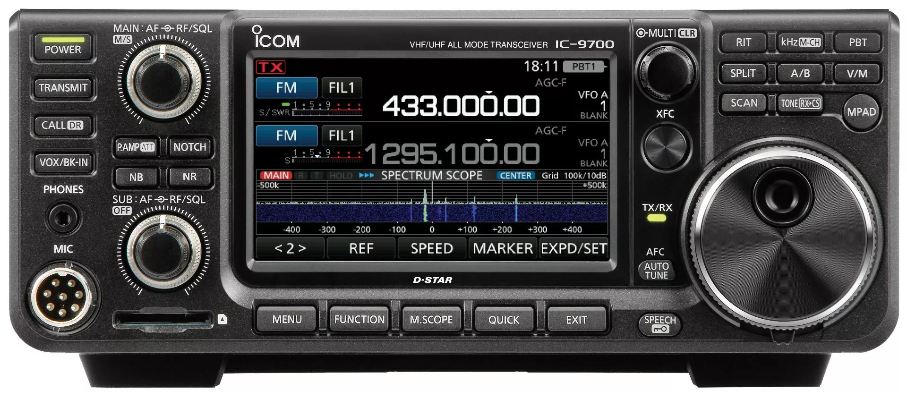
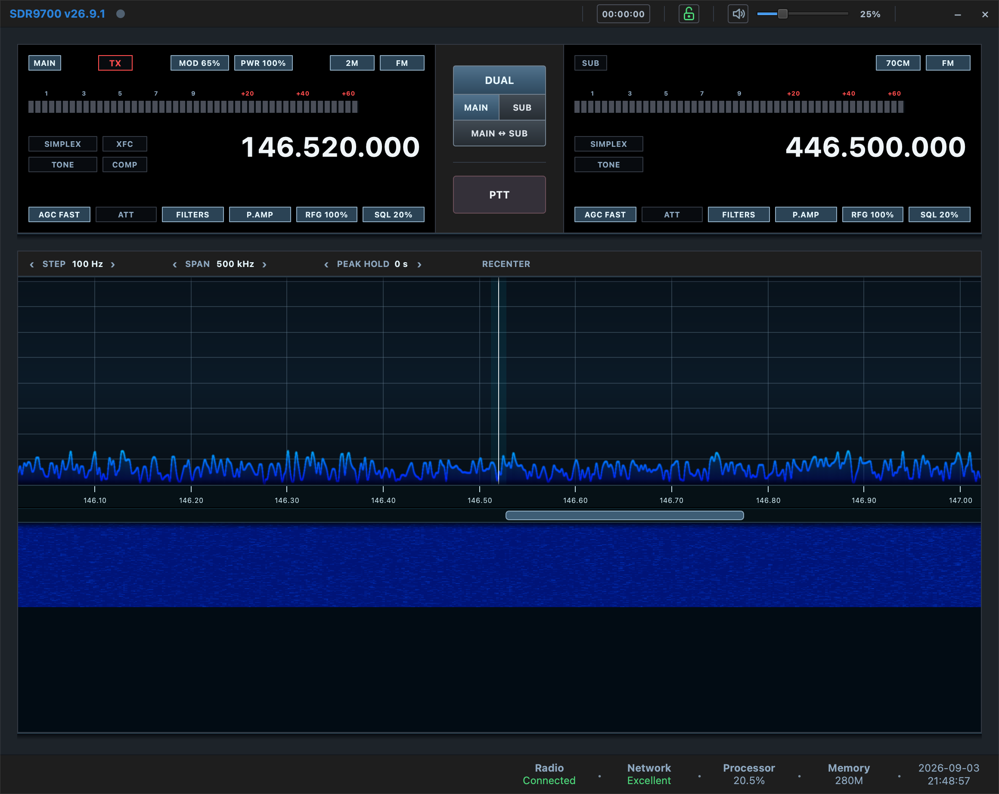

# SDR9700

SDR9700 is a native Qt GUI for controlling the Icom IC-9700 amateur radio
transceiver over the radio's LAN interface. Supported operating systems
include Linux and macOS (Apple Silicon).

The project provides radio connection profiles, VFO control, spectrum and
waterfall display, gain/PTT controls, and RX/TX audio routing through Qt
Multimedia.



## Screenshots



## Status

SDR9700 is early-stage software. The current codebase is shaped into a clean
IC-9700 project. The application builds and provides a
usable IC-9700 LAN control surface, but some workflows still need broader
hardware testing and polish before a stable release.

## Implemented Functionality

- Saved IC-9700 LAN radio profiles with username/password storage encrypted at
  rest.
- Radio chooser and preferences dialogs, including auto-connect and audio
  device selection.
- IC-9700 LAN connection over the radio UDP ports, with connection status,
  network quality reporting, and user-facing connection error messages.
- VFO frequency and mode display/control for the active operating flow.
- Radio-backed controls for RF gain, squelch, RF power, mic gain, noise
  reduction, noise blanker, preamp, attenuator, offset, tone mode, CTCSS tone,
  and DCS/DTCS code.
- Local AF gain and mute controls.
- PTT control and LAN transmit audio support, including LAN MOD level control
  and transmit audio ramping.
- Spectrum and waterfall display from IC-9700 scope data, with zoom controls and
  mouse interaction for frequency movement.
- S-meter display and network/status bar indicators, including CPU and memory
  usage.
- VFO step selector for configurable tuning step sizes.
- DTMF send panel with PTT gating.
- Radio-backed IC-9700 memory management with add/edit/copy/remove, periodic and
  on-demand synchronization, CSV import/export, band filtering, ordering, and
  selection from both the main window and Memory Manager.
- Main-window lock mode that prevents accidental radio-control changes while
  leaving PTT, mute, and AF gain usable.
- Icom RC-28 rotary controller support for step tuning and button mapping,
  including LED feedback (requires `libhidapi` when building from source).

## Installation

### macOS (Apple Silicon)

Download the `SDR9700-<version>-macOS-apple-silicon.dmg` release, open it, and
drag SDR9700 into Applications.

The release application includes Qt and its other runtime libraries. Users do
not need Homebrew, a separate Qt installation, or any other developer package
to run SDR9700. macOS will request local-network and microphone access because
the application communicates with the radio and can send transmit audio.

### Linux

Prebuilt Linux packages are not currently published. Follow the source-build
instructions below.

## Building from Source

Building requires a C++ toolchain, CMake, Ninja, GNU Make, pkg-config, Qt 6,
OpenSSL, Opus, SpeexDSP, Eigen, and optionally HIDAPI for RC-28 support.

On Debian, Ubuntu, and related Linux distributions:

```bash
sudo apt install build-essential cmake ninja-build pkg-config \
  qt6-base-dev qt6-multimedia-dev libssl-dev libopus-dev libspeexdsp-dev \
  libxkbcommon-dev libeigen3-dev libhidapi-dev
```

To let the signed-in desktop user access an Icom RC-28 without running
SDR9700 as root, install the included udev rule, reload the rules, and reconnect
the controller:

```bash
sudo install -m 0644 resources/packaging/linux/60-sdr9700-rc28.rules \
  /etc/udev/rules.d/60-sdr9700-rc28.rules
sudo udevadm control --reload-rules
sudo udevadm trigger --subsystem-match=hidraw
```

On macOS (Apple Silicon), Homebrew may be used to install build dependencies:

```bash
brew install cmake ninja pkg-config qt openssl@3 opus speexdsp eigen hidapi
```

Homebrew is needed only by developers building from source. It is not an
end-user runtime requirement.

```bash
make release
make run
```

`make release` performs a clean Release build in `src/build`. Only Release and
Debug CMake configurations are supported:

```bash
make debug
```

## Repository Layout

- `src/gui/`: Qt widgets and dialogs.
- `src/models/`: UI-facing radio state models.
- `src/backend/`: bridge between models and the IC-9700 protocol stack.
- `src/radio/`: IC-9700 LAN and CI-V radio protocol code.
- `src/audio/`: Qt Multimedia audio handlers and conversion utilities.
- `src/core/`: settings, profile storage, queues, and shared types.
- `resources/`: shared images, Qt resources, and platform-specific packaging
  assets under `resources/packaging/`.

## Root Documentation

- `AGENTS.md`: canonical AI-agent project guide.
- `CONVENTIONS.md`: coding standards and engineering rules.
- `CONTRIBUTING.md`: contributor workflow.
- `DEBUG.md`: developer diagnostics.
- `ARCHITECTURE.md`: current technical architecture.
- `SECURITY.md`: vulnerability reporting.
- `CODE_OF_CONDUCT.md`: community behavior expectations.

## Acknowledgements

SDR9700 benefited from the public work, operator experience, and hard-won
lessons of the AetherSDR, wfview, and radio-webop projects. Their codebases and
communities helped validate radio behavior, highlight practical implementation
details, and provide useful points of comparison while SDR9700 was shaped into
its own IC-9700-focused application.

## License

SDR9700 is licensed under the GNU General Public License version 3. See
`LICENSE` for the full license text.

Third-party attribution is tracked in `THIRD_PARTY_LICENSES.md`.
