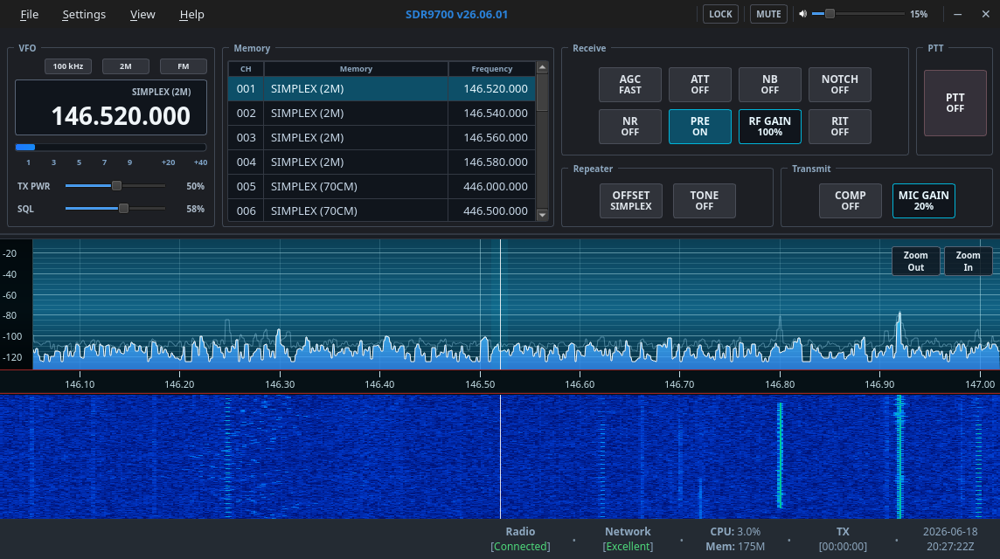

# SDR9700

SDR9700 is a Linux-native Qt GUI for controlling the Icom IC-9700 amateur
radio transceiver over the radio's LAN interface.

The project is open source and focused on a native Linux operator experience:
radio connection profiles, VFO control, spectrum and waterfall display, basic
gain/PTT controls, and RX/TX audio routing through Qt Multimedia.


## Screenshots



## Status

SDR9700 is early-stage software. The current codebase is shaped into a clean
IC-9700 project. The application builds and provides a
usable IC-9700 LAN control surface, but some workflows still need broader
hardware testing and polish before a stable release.

## Implemented Functionality

- Saved IC-9700 LAN radio profiles with username/password storage encrypted at
  rest.
- Radio chooser and preferences dialogs, including auto-connect and audio
  device selection.
- IC-9700 LAN connection over the radio UDP ports, with connection status,
  network quality reporting, and user-facing connection error messages.
- VFO frequency and mode display/control for the active operating flow.
- Radio-backed controls for RF gain, squelch, RF power, mic gain, noise
  reduction, noise blanker, preamp, attenuator, offset, tone mode, CTCSS tone,
  and DCS/DTCS code.
- Local AF gain and mute controls.
- PTT control and LAN transmit audio support, including LAN MOD level control
  and transmit audio ramping.
- Spectrum and waterfall display from IC-9700 scope data, with zoom controls and
  mouse interaction for frequency movement.
- S-meter display and network/status bar indicators, including CPU and memory
  usage.
- VFO step selector for configurable tuning step sizes.
- DTMF send panel with PTT gating.
- Local SDR9700 memories stored outside the radio, with add/edit/copy/remove,
  import/export, band filtering, ordering, and selection-to-radio.
- Main-window lock mode that prevents accidental radio-control changes while
  leaving PTT, mute, and AF gain usable.
- Icom RC-28 rotary controller support for step tuning and button mapping,
  including LED feedback (requires `libhidapi` at build time).

## Future Work

- Broaden real-radio testing for disconnect/reconnect behavior, audio startup,
  scope/waterfall behavior, and edge-case packet handling.
- Continue tightening CI-V parser validation for malformed or unexpected radio
  responses.
- Add automated tests around settings, memories, protocol parsing, and UI-facing
  model behavior.
- Improve packaging for common Linux distributions.
- Add user documentation for setup, radio LAN configuration, audio routing, and
  memory workflows.
- Continue UI polish for accessibility, keyboard navigation, and smaller display
  sizes.
- Review whether additional IC-9700 features should be exposed after they are
  verified against the manuals and real radio behavior.

## Build

Install the required build packages first. SDR9700 needs a C++ toolchain, CMake,
Ninja, GNU Make, pkg-config, Qt 6, OpenSSL, Opus, SpeexDSP, xkbcommon, and
Eigen. On Debian, Ubuntu, and related distributions:

```bash
sudo apt install build-essential cmake ninja-build pkg-config \
  qt6-base-dev qt6-multimedia-dev libssl-dev libopus-dev libspeexdsp-dev \
  libxkbcommon-dev libeigen3-dev
```

SpeexDSP is provided by the system `libspeexdsp-dev` package.

```bash
make
./src/build/bin/SDR9700
```

For an explicit production build:

```bash
make release
```

To reset the build tree:

```bash
make clean
```

Use `src/build` as the project build directory. The `release` target cleans and
reconfigures that directory. Do not create agent-specific build directories such
as `build-codex`, `build-claude`, or similar variants.

## Repository Layout

- `src/gui/`: Qt widgets and dialogs.
- `src/models/`: UI-facing radio state models.
- `src/backend/`: bridge between models and the IC-9700 protocol stack.
- `src/radio/`: IC-9700 LAN and CI-V radio protocol code.
- `src/audio/`: Qt Multimedia audio handlers and conversion utilities.
- `src/core/`: settings, profile storage, queues, and shared types.
- `resources/`: manuals and README images.

## Root Documentation

- `AGENTS.md`: canonical AI-agent project guide.
- `CONVENTIONS.md`: coding standards and engineering rules.
- `CONTRIBUTING.md`: contributor workflow.
- `DEBUG.md`: developer diagnostics.
- `ARCHITECTURE.md`: current technical architecture.
- `SECURITY.md`: vulnerability reporting.
- `CODE_OF_CONDUCT.md`: community behavior expectations.

## Acknowledgements

SDR9700 benefited from the public work, operator experience, and hard-won
lessons of the AetherSDR, wfview, and radio-webop projects. Their codebases and
communities helped validate radio behavior, highlight practical implementation
details, and provide useful points of comparison while SDR9700 was shaped into
its own IC-9700-focused Linux application.

## License

SDR9700 is licensed under the GNU General Public License version 3. See
`LICENSE` for the full license text.

Third-party attribution is tracked in `THIRD_PARTY_LICENSES.md`.
